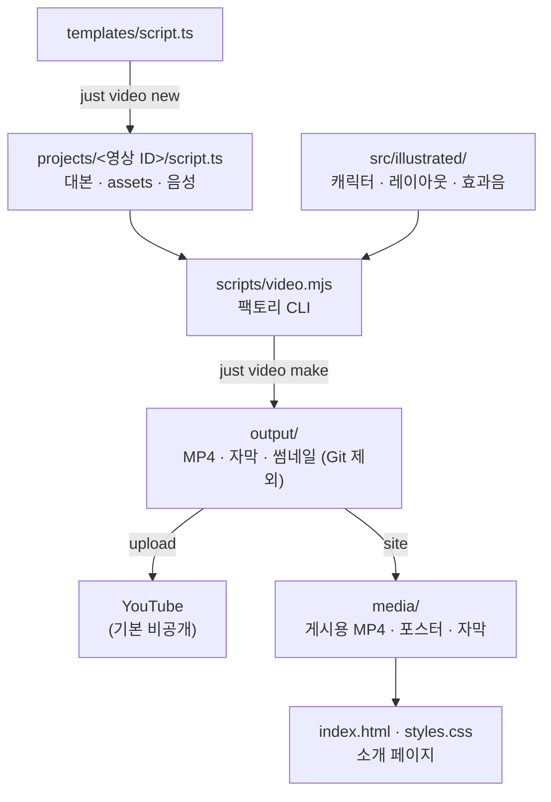

# PRISM 소개 페이지 · 영상 팩토리

PRISM(Workspace + ERP 사내 플랫폼)의 공개 소개 사이트와, 대본만 넣으면 같은 품질의 한국어 영상을 만들어 주는 영상 팩토리입니다. 원본 프로젝트 코드와 실제 업무 데이터는 공개하지 않습니다.

- 사이트: https://savvy773.github.io/prism-platform-site/ (`main` 브랜치 루트, GitHub Pages)
- 구성: 정적 HTML·CSS(`index.html`, `styles.css`) + 영상 팩토리(`apps/video/`)

## 영상

| 영상 | 길이 | 내용 |
| --- | --- | --- |
| `prism-intro-ko` 3분 만에 보는 PRISM | 3:33 | 흩어진 업무가 하나로 모이는 이야기, 실제 화면(예시 데이터) 포함 |

2D 일러스트, 프리즘 가이드·김 대리 캐릭터, Gemini TTS 한국어 내레이션, 효과음, 자막, YouTube 챕터가 들어갑니다.

## 빠른 시작

```bash
cd apps/video
pnpm install
cp .env.example .env
cd ../..
```

`.env`에 본인 `GEMINI_API_KEY`를 입력합니다. 이 파일은 Git에서 제외되므로 커밋하지 마세요.

| 명령 | 하는 일 |
| --- | --- |
| `just video new my-video` | `projects/my-video/script.ts` 생성 |
| `just video make my-video` | 음성 → MP4·자막·챕터·썸네일 |
| `just video upload my-video` | YouTube 업로드 (기본 비공개) |
| `just video site my-video` | 사이트 `media/`로 내보내기 |

`just video`만 치면 미리보기 Studio가 열리고, `just video list`로 영상 목록과 상태를 봅니다. 여러 개는 `just video make a b c` 또는 `--all`.

## 구조



## 문서

- [영상 작업 설명서](docs/VIDEO_WORKFLOW.md): 대본 작성, TTS, 효과음·스크린샷, 앞으로의 방향
- [Git 동기화](docs/GIT_SYNC.md): 연속성
- [구조](docs/ARCHITECTURE.md) · [결정 기록](docs/decisions.md) · [에이전트 지침](AGENTS.md)

일러스트 화면은 이해를 돕기 위한 예시이고, 실제 화면은 예시 데이터로 촬영한 것만 씁니다.

## 문의

개발 문의: [juns@prismlight.co.kr](mailto:juns@prismlight.co.kr)
