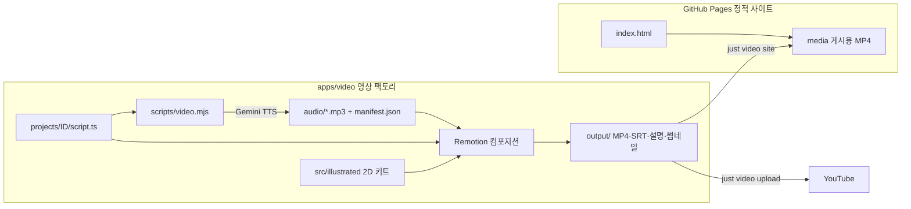

# PRISM 소개 사이트 구조

공개 소개 페이지와 대본 기반 영상 팩토리로 구성됩니다. WEB, ERP, Auth 본체의 코드나 실제 업무 데이터는 포함하지 않습니다.

- `src/data/registry.ts`: `projects/*/script.ts`를 자동으로 찾아 컴포지션으로 등록
- `src/Root.tsx`: `calculateMetadata`로 `manifest.json`의 음성 길이를 읽어 장면 길이를 정함
- `src/data/captions.ts`: 화면 자막과 `.srt`가 같은 타이밍을 쓰도록 공유
- `src/illustrated/`: 테마, 폰트(Jua·Gowun Dodum), 아이콘, 캐릭터(프리즘 가이드·김 대리), 스티커, 효과음(`sfx/`, `scripts/make-sfx.mjs`로 생성), 장면 템플릿(스크린샷 포함)

스택: TypeScript 7, React 19, Remotion 4, Biome 2, pnpm 12, Gemini TTS(선택: Edge TTS), YouTube Data API v3.
