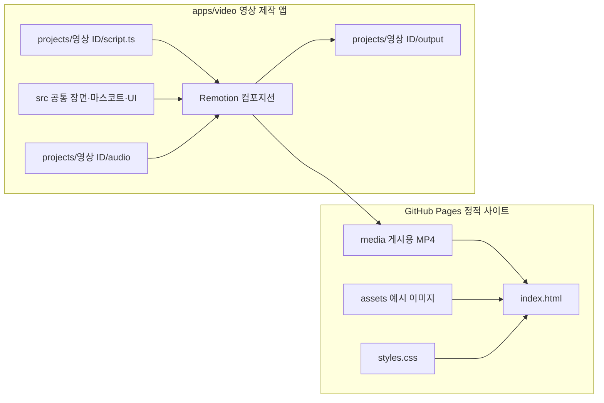
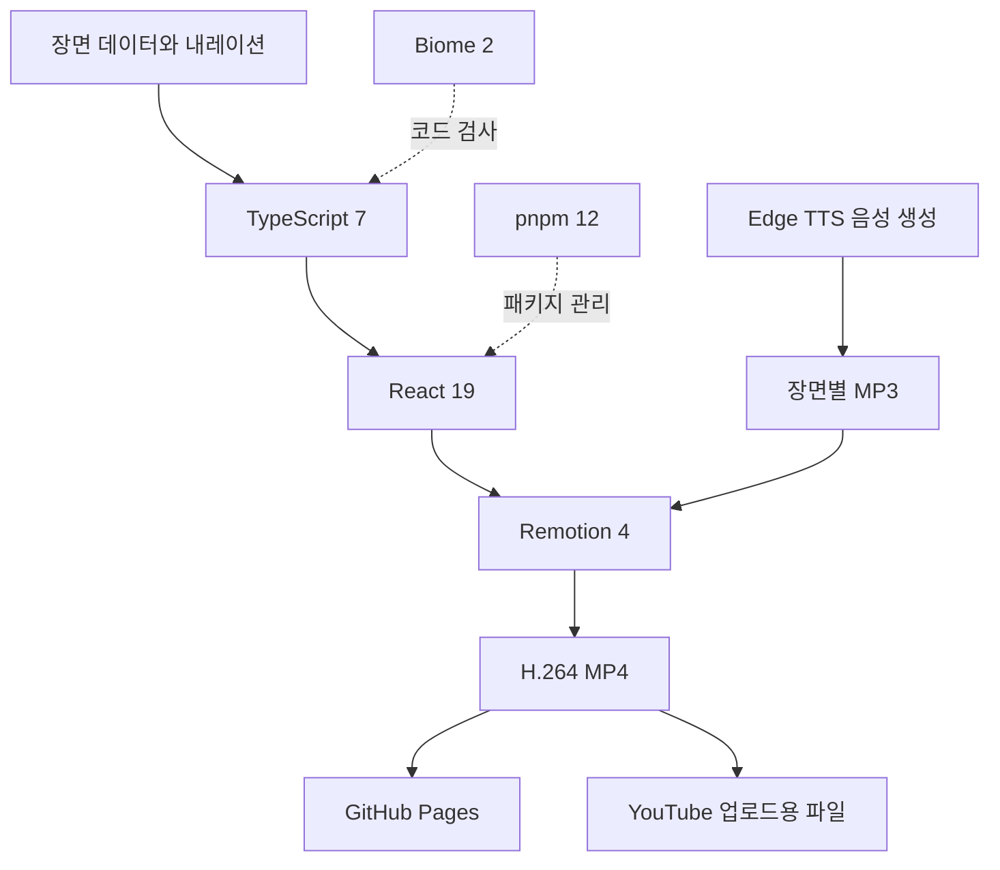

# PRISM 소개 사이트 구조

이 저장소는 공개 소개 페이지와 독립 영상 제작 앱으로 구성됩니다. WEB, ERP, Auth 본체의 코드나 실제 업무 데이터는 포함하지 않습니다.

## 기술 스택

`src/data/registry.ts`가 영상별 대본을 컴포지션으로 등록합니다. `src/compositions/ScriptVideo.tsx`는 대본의 장면 순서와 길이를 읽어 공통 렌더러를 실행합니다. 새 영상은 프로젝트 폴더와 레지스트리 항목을 추가하면 됩니다.

현재 랜딩 영상은 1920×1080, 30fps, 52초입니다. 새 YouTube 영상은 약 2분을 출발점으로 하고 대본에 맞춰 앞뒤 장면을 늘릴 수 있습니다. 총 프레임 수는 장면 길이의 합으로 계산됩니다.
